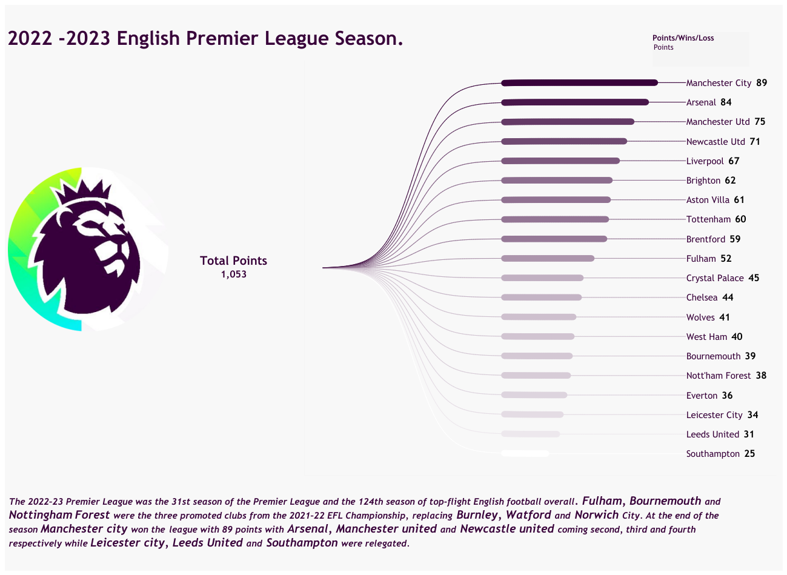

# Web Scrapping 2022 -2023 English Premier League Season Table

This project involves web scraping data from a specific website to gather information related to the Premier League. The extracted data will be used to build a dashboard in **Tableau** for visualization and analysis.

## Data Description

**premierLeagueData.csv:** This CSV file contains the data extracted from the website. It includes columns such as 'Team', 'Points', 'Goals Scored', etc. This data serves as the source for the Tableau dashboard.

## Tableau Dashboard

The Tableau dashboard is designed to provide insightful visualizations and analysis of the Premier League data based on the **Total points,** **Total Goals** and **Tota Loss**.

You can click on this [Link](https://public.tableau.com/app/profile/israel.joseph/viz/2022-2023EnglishPremierLeagueSeason_/2022-2023EnglishPremierLeagueSeason_?publish=yes) to explore the dashboard.